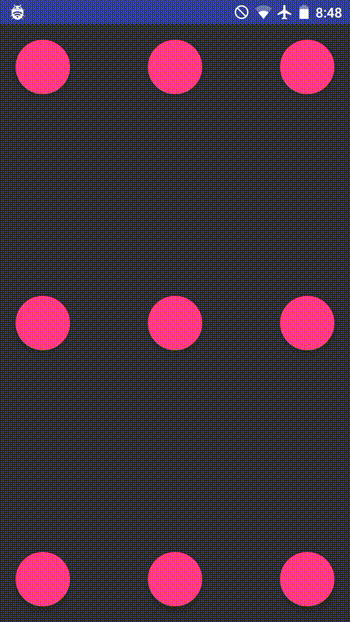

# Morphing Material Dialogs
[](https://jitpack.io/#AdityaAnand1/Morphing-Material-Dialogs)
[](https://travis-ci.org/AdityaAnand1/Morphing-Material-Dialogs)
[](https://github.com/AdityaAnand1/Morphing-Material-Dialog/blob/master/LICENSE.txt)


A library for fab-to-dialog morphing (as in Nick Butcher's [Plaid](https://github.com/nickbutcher/plaid)) with Aidan Follestad's [Material Dialogs](https://github.com/afollestad/material-dialogs).

# Table of Contents
1. [Setup Instructions](https://github.com/AdityaAnand1/Morphing-Material-Dialogs#setup-instructions)
2. [Usage Instructions](https://github.com/AdityaAnand1/Morphing-Material-Dialogs#usage-instructions)
3. [Customization](https://github.com/AdityaAnand1/Morphing-Material-Dialogs#customization)
4. [Misc](https://github.com/AdityaAnand1/Morphing-Material-Dialogs#misc)

## Setup Instructions

 Add the following to your root (project) level build.gradle:

```gradle
	allprojects {
		repositories {
			...
			maven { url 'https://jitpack.io' }
		}
	}
```

Add the library to your app's build.gradle

```gradle
	dependencies {
		implementation 'com.github.AdityaAnand1:Morphing-Material-Dialogs:0.0.3'
		//you should also have the design support library, since we're using the native floating action button
   		implementation "com.android.support:design:27.0.2"
	}
```

In your styles.xml, override the MorphDialog.Base themes (at least one, both if you wish to support light and dark themes for your app)

```xml
    <style name="MorphDialog.Custom.Light" parent="MorphDialog.Base.Light">
        <item name="colorPrimary">@color/primary</item>
        <item name="colorPrimaryDark">@color/primary_dark</item>
        <item name="colorAccent">@color/accent</item>
    </style>

    <style name="MorphDialog.Custom.Dark" parent="MorphDialog.Base.Dark">
        <item name="colorPrimary">@color/primary</item>
        <item name="colorPrimaryDark">@color/primary_dark</item>
        <item name="colorAccent">@color/accent</item>
    </style>
 ```
 
 In your app's manifest file, add the following (at least one, both if you wish to support light and dark themes for your app)
 
 ```xml
    <activity
        android:name="com.adityaanand.morphdialog.MorphDialogActivity"
        android:theme="@style/MorphDialog.Custom.Light">
    </activity>
    <activity
        android:name="com.adityaanand.morphdialog.MorphDialogActivityDark"
        android:theme="@style/MorphDialog.Custom.Dark">
    </activity>
 ```
 
 ## Usage instructions
 
This library mirror's a subset of [afollestad/material-dialogs](https://github.com/afollestad/material-dialogs) API.
  
 ```java
 new MorphDialog.Builder(this, fabView)
                .title("Title")
                .content("This is a sentence. Here is another one.") 
                .positiveText(R.string.ok)
                .onPositive((MorphDialog dialog1, MorphDialogAction which) -> {
                    Toast.makeText(this, "onPositive", Toast.LENGTH_SHORT).show();
                })
                .useDarkTheme(true) //optional, default is false
                .show();
 ```
 
 
For example, if you have a floating action button in your activity
 
 ```xml
        <android.support.design.widget.FloatingActionButton
            android:layout_width="wrap_content"
            android:layout_height="wrap_content"
            android:onClick="morph"/>
```

Then your `morph()` might look like:

```java
    public void morph(View view) {
        new MorphDialog.Builder(this, (FloatingActionButton) view)
                .title("Title")
                .content("This is a sentence. Here is another one.")
                .show();
    }
```

## Customization

### Listen for action button callbacks

MorphDialog is not a dialog. It's another activity and the only way to get back the result of any interactions with it is through `onActivityResult()`.

In order to use the `.onPositive()`, `.onNegative()`, `.onNeutral` or `.onAny()` callbacks, you must pass on the activity result to the morphDialog object. You must do this for each dialog that you are using individually.

```
    MorphDialog dialog1;
    MorphDialog dialog2;
    
    void buildDialog(){
     dialog1 = new MorphDialog.Builder(this, (FloatingActionButton) view)
                .title("Title")
                .content("This is a sentence. Here is another one.")
                .positiveText(R.string.ok)
                .negativeText("Cancel")
                .neutralText("More")
                .onPositive((MorphDialog dialog1, MorphDialogAction which) -> {
                    Toast.makeText(this, "onPositive", Toast.LENGTH_SHORT).show();
                })
                .onNegative((MorphDialog dialog1, MorphDialogAction which) -> {
                    Toast.makeText(this, "onNegative", Toast.LENGTH_SHORT).show();
                })
                .onNeutral((MorphDialog dialog1, MorphDialogAction which) -> {
                    Toast.makeText(this, "onNeutral", Toast.LENGTH_SHORT).show();
                })
                .build();
	}
	
    
    @Override
    protected void onActivityResult(int requestCode, int resultCode, Intent data) {
        super.onActivityResult(requestCode, resultCode, data);
        dialog1.onActivityResult(requestCode, resultCode, data);
        dialog2.onActivityResult(requestCode, resultCode, data);
    }
```

If you have a large number of dialogs you may prefer to use the helper function instead, which uses a varargs parameter to register the callback to multiple dialog objects:

```
    @Override
    protected void onActivityResult(int requestCode, int resultCode, Intent data) {
        super.onActivityResult(requestCode, resultCode, data);
	MorphDialog.registerOnActivityResult(requestCode, resultCode, data, dialog1, dialog2, dialog3);
    }
```

Also, note that you will receive the callbacks only after the animation has ended. 

### Set Canceleable

If you do not want the dialog to close when tapping outside the dialog you can use `builder.cancelable(false)`

### Customize Colors

The following methods can be used to customize the different colors in your dialog
```
new MorphDialog.Builder(context, (FloatingActionButton) view)
                .contentColor(Color.BLUE)
                .backgroundColor(Color.GREEN)
                .neutralColorRes(R.color.primary)
                .positiveColor(Color.BLACK)
                .titleColor(Color.YELLOW);
```

### Theme overrides

Override the `android:windowBackground` attribute to provide a custom color for the area outside of the dialog.

```
    <style name="MorphDialog.Custom.Light" parent="MorphDialog.Base.Light">
        <item name="android:windowBackground">@color/windowBackground</item>
    </style>
```


## Misc

#### What happens below API 21 (<Lollipop)?

Nothing. Since this library uses activity transitions which are properly supported only for Lollipop and up, the dialog pops up normally without any morphing animation below Lollipop.

#### Why does the library not support all of Material Dialogs features?

The problem is passing the instructions to build a MaterialDialog (i.e,a  MaterialDialog.Builder object) to another activity. The Builder class is not Parcelable and contains a lot of context aware fields like custom views. In the current architecture, there's no clear path to doing this without explicitly adding memory leaks. ([Suggestions welcome](https://github.com/AdityaAnand1/Morphing-Material-Dialogs/issues/new))

#### I want to morph **from something other than a fab**/ I want to morph **to something other than MorphDialog**

Currently, this library does not support morphing something-other-than-a-fab to something-other-than-a-material-dialog transition. If you'd like for it to work in another setting, say a custom view, head over to the [standalone](https://github.com/AdityaAnand1/Morphing-Material-Dialogs/tree/master/standalone) module and check out the minimal implementation (without all the library plumbing) that should point you in the direction of a custom solution.

----

Fun fact: This library was originally built for [Timbre](https://play.google.com/store/apps/details?id=xeus.timbre).


